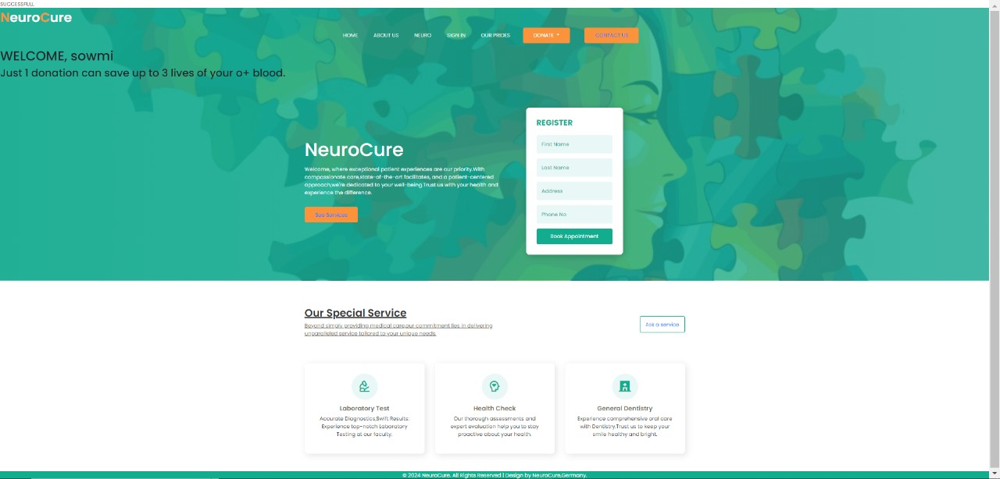

# Neurodiversity
***About***
A webpage using HTML, CSS, BootStrap5 with required scripting using Javascript and PHP.

## Steps to Run our code:

1.Clone our repository

2.Navigate to the project directory

3.View the code in any Text Editor

4.Open index.html in Web Browser

## Functionality we provided in our website :

We have designed a website that provides the information about a disorder named **Neurodiversity**.

Additional: We have also said about the importance of Donation in our website.We have also inserted a pie chart for it.

Do Explore all pages that we have provided in navbar!😊
